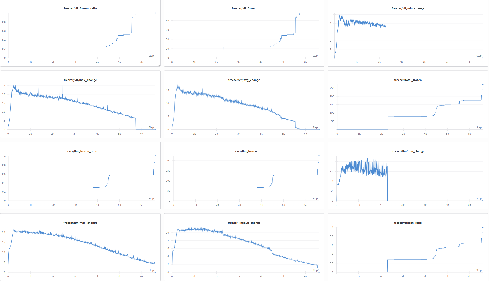

# 🎯 GradES: Gradient-based Early Stopping

[](https://badge.fury.io/py/grades)
[](https://www.python.org/downloads/)
[](https://opensource.org/licenses/MIT)
[](https://arxiv.org/abs/2509.01842)

Official implementation of **GradES** - a gradient-based selective training method that dynamically freezes converged modules during fine-tuning to achieve **40-50% computational savings** without sacrificing model performance.

## 📄 Paper
**GradES: Significantly Faster Training in Transformers with Gradient-Based Early Stopping**
*Qifu Wen, Xi Zeng, Zihan Zhou, Shuaijun Liu, Mehdi Hosseinzadeh, Ningxin Su and Reza Rawassizadeh*
📖 [arXiv:2509.01842](https://arxiv.org/abs/2509.01842)

## 🚀 Quick Installation

### From PyPI
```bash
pip install grades
```

### From Source
```bash
git clone https://github.com/IXZZZ9/GradES.git
cd GradES
pip install -e .
```

### For Development
```bash
git clone https://github.com/IXZZZ9/GradES.git
cd GradES
pip install -e ".[dev,wandb,examples]"
```

## 💡 Quick Start

### Basic Usage with Transformers

```python
from grades import GradEarlyStoppingCallback, GradEarlyStoppingConfig
from transformers import Trainer, TrainingArguments

# Configure GradES
config = GradEarlyStoppingConfig(
    tau=0.023,           # Convergence threshold
    alpha=0.55,          # Minimum training progress before freezing
    enable_wandb_logging=True
)

# Create callback
callback = GradEarlyStoppingCallback(config)

# Use with any Transformers Trainer
trainer = Trainer(
    model=model,
    args=training_args,
    train_dataset=train_dataset,
    callbacks=[callback]
)

trainer.train()
```

### Integration with Unsloth (Recommended)

GradES seamlessly integrates with [Unsloth](https://github.com/unslothai/unsloth) for ultra-fast LLM fine-tuning:

#### 🔥 LoRA Fine-tuning
```python
from grades import GradEarlyStoppingCallback, GradEarlyStoppingConfig
from trl import SFTTrainer, SFTConfig

# GradES configuration for LoRA
config = GradEarlyStoppingConfig(
    tau=0.021637,
    alpha=0.55,
    enable_wandb_logging=True,
)
callback = GradEarlyStoppingCallback(config)

# Unsloth SFTTrainer with GradES
trainer = SFTTrainer(
    model=model,
    tokenizer=tokenizer,
    train_dataset=combined_dataset,
    callbacks=[callback],
    args=SFTConfig(
        dataset_text_field="text",
        per_device_train_batch_size=1,
        gradient_accumulation_steps=4,
        warmup_ratio=0.05,
        max_steps=60,
        learning_rate=2e-4,
        logging_steps=1,
        optim="adamw_torch",
        weight_decay=0.01,
        lr_scheduler_type="cosine",
        seed=3407,
        report_to="wandb",
        gradient_checkpointing=True,
        dataloader_pin_memory=True,
        dataloader_num_workers=0,
        remove_unused_columns=False,
    ),
)
```

#### 🚀 Full Fine-tuning (FFT)
```python
from grades import GradEarlyStoppingCallback, GradEarlyStoppingConfig

# GradES configuration for FFT
config = GradEarlyStoppingConfig(
    tau=2.404167,
    alpha=0.55,  # Higher alpha for FFT
    enable_wandb_logging=True,
)
callback = GradEarlyStoppingCallback(config)

# Set full_finetuning=True in FastLanguageModel.from_pretrained
# Remove FastLanguageModel.get_peft_model LoRA setup

trainer = SFTTrainer(
    model=model,
    tokenizer=tokenizer,
    train_dataset=combined_dataset,
    callbacks=[callback],
    args=SFTConfig(
        dataset_text_field="text",
        per_device_train_batch_size=1,
        gradient_accumulation_steps=4,
        warmup_ratio=0.05,
        num_train_epochs=1,
        learning_rate=2e-5,
        logging_steps=1,
        optim="adamw_torch",
        weight_decay=0.01,
        lr_scheduler_type="cosine",
        seed=3407,
        report_to="wandb",
        gradient_checkpointing=True,
        dataloader_pin_memory=True,
        dataloader_num_workers=0,
        remove_unused_columns=False,
    ),
)
```

### Vision-Language Models (VLMs)
```python
from grades import VLMGradEarlyStoppingCallback, VLMGradEarlyStoppingConfig

# Configure for VLMs
vlm_config = VLMGradEarlyStoppingConfig(
    vision_tau=1e-4,
    language_tau=1e-3,
    alpha=0.3,
    enable_wandb_logging=True
)

vlm_callback = VLMGradEarlyStoppingCallback(vlm_config)
```

## 🎯 Try it Now!

### Google Colab Integration

Ready-to-use notebooks with minimal setup:

#### 🦙 LLM Fine-tuning with Unsloth
[](https://colab.research.google.com/github/unslothai/notebooks/blob/main/nb/Llama3.1_(8B)-Alpaca.ipynb)

**Quick Setup:**
1. Open the [Unsloth Llama3.1 notebook](https://colab.research.google.com/github/unslothai/notebooks/blob/main/nb/Llama3.1_(8B)-Alpaca.ipynb)
2. Add this cell after imports:
   ```python
   !pip install grades
   ```
3. Replace the trainer setup with the GradES examples above
4. Run and enjoy 40-50% faster training! 🚀

#### 🖼️ VLM Fine-tuning with Hugging Face

This guide shows how to adapt a standard VLM fine-tuning script, like the [Unsloth Qwen2.5 VL notebook](https://colab.research.google.com/github/unslothai/notebooks/blob/main/nb/Qwen2.5_VL_(7B)-Vision.ipynb), to use GradES with the Hugging Face `Trainer`.
[](https://colab.research.google.com/github/unslothai/notebooks/blob/main/nb/Qwen2.5_VL_(7B)-Vision.ipynb)

**1. Installation**

First, install GradES and the necessary libraries:

```python
!pip install grades
!pip install transformers datasets peft accelerate bitsandbytes
```

**2. Load Model and Processor**

Instead of Unsloth's `FastVisionModel`, use the standard Hugging Face `AutoModelForImageTextToText` and `AutoProcessor`.

```python
from transformers import AutoModelForImageTextToText, AutoProcessor
import torch

model = AutoModelForImageTextToText.from_pretrained(
    "Qwen/Qwen2.5-VL-7B-Instruct",
    torch_dtype=torch.bfloat16,
    trust_remote_code=True,
)

processor = AutoProcessor.from_pretrained(
    "Qwen/Qwen2.5-VL-7B-Instruct",
    trust_remote_code=True,
)
```

**3. Configure Fine-tuning Method (LoRA or FFT)**

#### For LoRA Fine-tuning:

Apply LoRA configuration using `peft`.

```python
from peft import LoraConfig, get_peft_model, TaskType

peft_config = LoraConfig(
    r=128,
    lora_alpha=256,
    target_modules=[
        "q_proj", "k_proj", "v_proj", "o_proj",
        "gate_proj", "up_proj", "down_proj",
        "qkv", "proj",
    ],
    lora_dropout=0.0,
    bias="none",
    task_type=TaskType.CAUSAL_LM,
)

model = get_peft_model(model, peft_config)
```

#### For Full Fine-tuning (FFT):

No special configuration is needed. Just use the model as loaded in step 2.

**4. Prepare the Dataset**

You can reuse the data preparation logic from the Unsloth notebook to format your dataset. The key is to have a dataset of conversations in the format expected by the model.

**5. Integrate GradES**

Now, configure and add the `VLMGradEarlyStoppingCallback`.

```python
from grades import VLMGradEarlyStoppingCallback, VLMGradEarlyStoppingConfig
from transformers import TrainingArguments, Trainer

# Configure GradES for VLM
vlm_config = VLMGradEarlyStoppingConfig(
    vision_tau=33.0, # Threshold for vision components with LoRA 16-bit
    language_tau=3.3, # Threshold for LLM components with LoRA 16-bit
    alpha=0.3,
    enable_wandb_logging=True # If you use wandb
)

vlm_callback = VLMGradEarlyStoppingCallback(vlm_config)

# Define Training Arguments
training_args = TrainingArguments(
    output_dir="./vlm_finetune_with_grades",
    per_device_train_batch_size=1,
    gradient_accumulation_steps=1,
    num_train_epochs=1,
    learning_rate=1e-4,
    logging_steps=1,
    report_to="wandb",
    # Add other necessary arguments
)

# Create the Trainer
trainer = Trainer(
    model=model,
    args=training_args,
    train_dataset=your_prepared_dataset,
    data_collator=your_data_collator, # A data collator for VLM is needed
    callbacks=[vlm_callback],
)
```

**6. Start Training**

Finally, start the training process.

```python
trainer.train()
```

By following these steps, you can seamlessly integrate GradES into your Hugging Face VLM fine-tuning workflow for both LoRA and FFT, achieving significant computational savings.

#### 🖼️ VLM Fine-tuning with Unsloth (FFT)

This guide demonstrates how to use GradES for Full Fine-Tuning (FFT) of a Vision-Language Model with Unsloth.

**1. Installation**

Install GradES and Unsloth.

```python
!pip install grades
!pip install "unsloth[colab-new] @ git+https://github.com/unslothai/unsloth.git"
```

**2. Load Model for Full Fine-tuning**

Load the model using `FastVisionModel` and set `full_finetuning=True`.

```python
from unsloth import FastVisionModel
import torch

model, tokenizer = FastVisionModel.from_pretrained(
    "unsloth/Qwen2.5-VL-7B-Instruct-unsloth-bnb-4bit",
    load_in_4bit=True,
    device_map="auto",
    full_finetuning=True,
    trust_remote_code=True,
)
```

**3. Prepare Dataset**

Prepare your dataset as a list of conversations. The structure should be the same as in the Hugging Face or Unsloth examples.

**4. Integrate GradES**

Configure `VLMGradEarlyStoppingCallback` with the appropriate thresholds for FFT and add it to the `SFTTrainer`.

```python
from grades import VLMGradEarlyStoppingCallback, VLMGradEarlyStoppingConfig
from unsloth.trainer import UnslothVisionDataCollator
from trl import SFTTrainer, SFTConfig

# Configure GradES for VLM FFT
vlm_config = VLMGradEarlyStoppingConfig(
    vision_tau=0.13,      # Threshold for vision components
    language_tau=0.09,   # Threshold for language components
    alpha=0.3,           # Start freezing after 10% of training
    enable_wandb_logging=True
)

vlm_callback = VLMGradEarlyStoppingCallback(vlm_config)

# Set up the Trainer
trainer = SFTTrainer(
    model=model,
    tokenizer=tokenizer,
    train_dataset=your_prepared_dataset,
    data_collator=UnslothVisionDataCollator(model, tokenizer),
    callbacks=[vlm_callback],
    args=SFTConfig(
        per_device_train_batch_size=1,
        gradient_accumulation_steps=1,
        num_train_epochs=1,
        warmup_ratio=0.1,
        learning_rate=2e-5,
        logging_steps=1,
        output_dir="outputs_vlm",
        optim="adamw_torch",
        seed=42,
        report_to="wandb",
        # Unsloth specific arguments
        remove_unused_columns=False,
        dataset_text_field="",
        dataset_kwargs={"skip_prepare_dataset": True},
    ),
)
```

**5. Start Training**

Launch the training process.

```python
trainer.train()
```

## 📊 Key Results

- ✅ **40-50% computational savings** compared to standard fine-tuning
- ✅ **Maintains or improves** model performance across multiple benchmarks
- ✅ **Tested on**: Qwen3, Phi4, Llama-3.1, and Mistral models (0.6B to 14B parameters)
- ✅ **Compatible with**: LoRA, Full Fine-tuning, and Vision-Language Models
- ✅ **Framework support**: Transformers, TRL, Unsloth

## ⚙️ Configuration Options

### GradEarlyStoppingConfig
```python
config = GradEarlyStoppingConfig(
    tau=1e-4,                    # Convergence threshold
    alpha=0.3,                   # Min training progress before freezing
    max_frozen_ratio=1.0,        # Max fraction of components to freeze
    compute_interval=1,          # Steps between gradient computations
    history_maxlen=1000,         # Gradient history buffer size
    enable_wandb_logging=False,  # WandB logging
    log_interval=10,             # Logging frequency
    save_stats=True,             # Save component statistics
    output_dir="./grades_output" # Output directory
)
```

## 🏗️ Package Structure

```
grades/
├── __init__.py                 # Main exports
├── gradient_early_stopping.py # LLM early stopping
└── vlm_early_stopping.py      # VLM early stopping
```

## 🤝 Contributing

We welcome contributions! Please feel free to submit a Pull Request.

## Wandb Example for Training nanoVLM

This is the training example on [nanoVLM](https://github.com/huggingface/nanoVLM), and reproducible code for training with GradES will be available soon.

## Performance
Below are accuracy for language benchmarks. 

| Model           | Method          | BoolQ  | PIQA  | SIQA  | HellaSwag | Winograde | OpenBookQA | ARC-C | ARC-E | Avg.  |
|-----------------|-----------------|--------|-------|-------|-----------|-----------|------------|-------|-------|-------|
| Qwen3 14B       | Full Parameter  | 91.07  | 91.29 | 81.93 | 95.11     | 83.03     | 91.60      | 94.31 | 98.07 | 90.80 |
|                 | FP+ES           | 91.07  | 91.08 | 81.99 | 95.05     | 83.03     | 91.40      | 93.98 | 98.07 | 90.71 |
|                 | FP+GradES       | **91.22** | 91.19 | 82.04 | 94.97     | 83.03     | **91.80** | **94.31** | 97.89 | **90.81** |
|                 | LoRA            | 90.86  | **91.24** | 81.68 | 95.21     | 83.35     | 91.40      | 94.31 | 97.19 | 90.65 |
|                 | LoRA+ES         | 90.64  | 91.08 | 81.99 | **95.40** | 81.53     | 91.40      | 93.65 | 97.54 | 90.40 |
|                 | LoRA+GradES     | 90.67  | 91.13 | **82.29** | 95.22     | **84.77** | 91.20      | 93.31 | 97.02 | 90.70 |
| Phi4 14B        | Full Parameter  | 90.49  | 91.95 | 83.27 | 95.49     | 88.71     | 93.00      | 94.31 | 98.25 | 91.93 |
|                 | FP+ES           | 90.34  | 92.11 | 82.55 | 95.50     | 88.56     | 93.00      | 94.31 | 98.07 | 91.80 |
|                 | FP+GradES       | 90.31  | **92.60** | **83.06** | 95.43     | **88.95** | 92.60      | 94.31 | 98.25 | **91.94** |
|                 | LoRA            | 90.31  | 92.00 | 82.45 | 95.36     | 87.53     | 91.80      | **94.65** | 98.07 | 91.52 |
|                 | LoRA+ES         | 90.61  | 92.22 | 82.60 | **95.44** | 87.37     | 92.00      | 94.31 | **98.25** | 91.60 |
|                 | LoRA+GradES     | **90.49** | 92.60 | 82.40 | 95.38     | 87.37     | 91.60      | 94.65 | 98.07 | 91.57 |
| Qwen3 0.6B      | Full Parameter  | 77.28  | 69.31 | 66.99 | 65.09     | 50.28     | 61.20      | 61.54 | 80.53 | 66.53 |
|                 | FP+ES           | 77.06  | 68.99 | 67.09 | 65.16     | 49.57     | 61.00      | 63.21 | 81.23 | 66.66 |
|                 | FP+GradES       | 77.03  | **71.38** | 66.84 | 64.26     | **51.62** | 62.40      | 61.20 | 79.65 | 66.80 |
|                 | LoRA            | **79.14** | 69.15 | **69.14** | 67.94     | 49.09     | **66.20** | 60.54 | 77.19 | 67.30 |
|                 | LoRA+ES         | 79.11  | 69.10 | 68.83 | **68.18** | 49.64     | 65.00      | 61.20 | 77.89 | **67.37** |
|                 | LoRA+GradES     | 78.56  | 69.42 | 68.17 | 68.20     | 49.41     | 65.40      | **61.54** | 77.72 | 67.30 |
| Llama-3.1-8B    | Full Parameter  | 89.27  | 88.08 | 81.01 | 94.40     | 81.93     | 85.00      | 83.61 | 92.46 | 86.97 |
|                 | FP+ES           | 89.24  | 87.81 | 80.86 | 94.42     | 82.56     | 85.80      | 82.61 | 92.11 | 86.93 |
|                 | FP+GradES       | 88.87  | **88.25** | 80.45 | 94.23     | 82.79     | 84.80      | **83.95** | **92.81** | **87.02** |
|                 | LoRA            | 87.98  | 87.65 | 79.73 | 94.31     | 80.35     | **87.20** | 83.28 | 91.40 | 86.49 |
|                 | LoRA+ES         | 88.62  | 88.19 | 79.32 | 94.20     | 80.35     | **87.20** | 83.28 | 91.75 | 86.62 |
|                 | LoRA+GradES     | **88.78** | 88.03 | **79.68** | **94.43** | **81.69** | 87.00      | 83.95 | 90.53 | 86.76 |
| Mistral-7B      | Full Parameter  | 85.26  | 80.25 | 77.33 | 83.71     | 66.30     | 75.60      | 62.54 | 75.44 | 75.80 |
|                 | FP+ES           | 85.32  | 80.09 | 76.20 | 83.95     | 57.54     | 74.60      | 64.21 | 74.39 | 74.54 |
|                 | FP+GradES       | 85.38  | 78.56 | 75.79 | 84.14     | 66.47     | 76.40      | 61.20 | 75.10 | 75.38 |
|                 | LoRA            | **89.33** | 87.43 | 79.79 | **94.95** | 79.72     | 84.20      | 76.25 | 88.42 | 85.01 |
|                 | LoRA+ES         | 88.93  | **88.30** | **81.01** | 94.69     | **82.24** | **85.00** | 79.60 | **90.35** | **86.27** |
|                 | LoRA+GradES     | 89.36  | 88.03 | 80.71 | 94.69     | 80.90     | 84.40      | **81.61** | 89.65 | 86.17 |


Results show accuracy (%) for Qwen2.5-VL-7B across visual reasoning (GQA), question answering (VQAv2), and image captioning (COCO Cap) tasks.

| Model | Method | GQA | VQAv2 | COCO Cap | Avg. |
|-------|--------|-----|-------|----------|------|
| Qwen2.5-VL-7B | Full Parameter | 75.69 | 81.0 | 41.38 | 66.08 |
| | FP+GradES | 76.08 | 80.81 | 41.61 | 66.20 |
| | LoRA | 76.49 | 81.01 | 53.22 | 70.24 |
| | LoRA+GradES | 76.13 | 81.24 | 54.44 | 70.6 |


Results show accuracy (%) for full-parameter fine-tuning with and without GradES across perception, reasoning, and knowledge-based tasks.

| Benchmark | Training | Training+GradES |
|-----------|----------|-----------------|
| Coarse Perception | 38.87 | 42.42 |
| Fine-grained Perception | 22.40 | 29.82 |
| Instance Reasoning | 36.07 | 36.42 |
| Logical Reasoning | 28.86 | 37.21 |
| Math | 27.60 | 28.60 |
| Science & Technology | 31.10 | 33.74 |
| **Avg.** | **30.82** | **34.70** |

---

## 📖 Citation

If you find GradES useful in your research, please cite:

```bibtex
@misc{wen2025gradessignificantlyfastertraining,
      title={GradES: Significantly Faster Training in Transformers with Gradient-Based Early Stopping}, 
      author={Qifu Wen and Xi Zeng and Zihan Zhou and Shuaijun Liu and Mehdi Hosseinzadeh and Ningxin Su and Reza Rawassizadeh},
      year={2025},
      eprint={2509.01842},
      archivePrefix={arXiv},
      primaryClass={cs.LG},
      url={https://arxiv.org/abs/2509.01842}, 
}
```
In this research, we utilize nanoVLM, Hugging Face, Unsloth, and PyTorch as core platforms for modeling, dataset handling, and deep learning infrastructure.
Wiedmann, L., Roy Gosthipaty, A., & Marafioti, A. (2025). nanoVLM. GitHub repository. https://github.com/huggingface/nanoVLM

Wolf, T., Debut, L., Sanh, V., Chaumond, J., Delangue, C., Moi, A., Cistac, P., Rault, T., Louf, R., Funtowicz, M., Davison, J., Shleifer, S., von Platen, P., Ma, C., Jernite, Y., Plu, J., Xu, C., Le Scao, T., Gugger, S., Drame, M., Lhoest, Q., & Rush, A. M. (2020). Transformers: State-of-the-Art Natural Language Processing. Proceedings of the 2020 Conference on Empirical Methods in Natural Language Processing: System Demonstrations, 38–45. Association for Computational Linguistics. https://www.aclweb.org/anthology/2020.emnlp-demos.6

Han, D., Han, M., & Unsloth Team. (2023). Unsloth. GitHub repository. https://github.com/unslothai/unsloth

Paszke, A., Gross, S., Massa, F., Lerer, A., Bradbury, J., Chanan, G., Killeen, T., Lin, Z., Gimelshein, N., Antiga, L., Desmaison, A., Kopf, A., Yang, E., DeVito, Z., Raison, M., Tejani, A., Chilamkurthy, S., Steiner, B., Fang, L., Bai, J., & Chintala, S. (2019). PyTorch: An Imperative Style, High-Performance Deep Learning Library. Advances in Neural Information Processing Systems, 32, 8024–8035.

## 📝 License

This project is licensed under the MIT License - see the [LICENSE](LICENSE) file for details.

## 🔗 Links

- 📖 **Paper**: [arXiv:2509.01842](https://arxiv.org/abs/2509.01842)
- 🐙 **GitHub**: [IXZZZ9/GradES](https://github.com/IXZZZ9/GradES)
- 📦 **PyPI**: [grades](https://pypi.org/project/grades/)
- 🤗 **Hugging Face**: [Coming Soon]
- 🦙 **Unsloth Integration**: [Colab Notebook](https://colab.research.google.com/github/unslothai/notebooks/blob/main/nb/Llama3.1_(8B)-Alpaca.ipynb)

---

**Made with ❤️ by the GradES Team**
